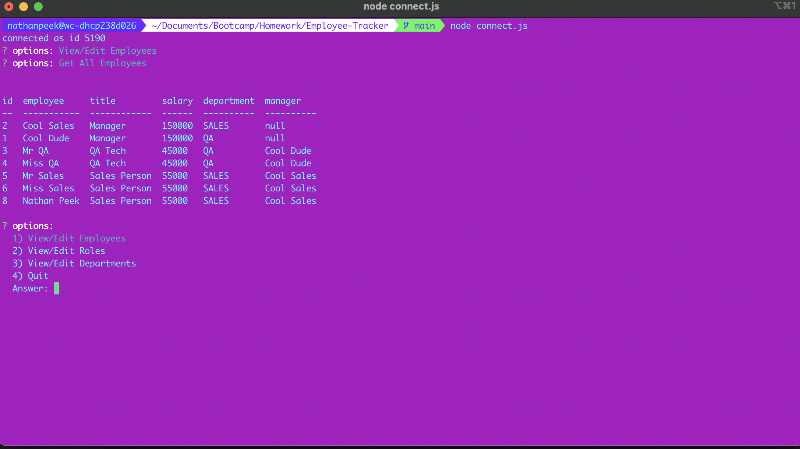

# Employee Tracker

## Table of Contents
- [Employee Tracker](#employee-tracker)
  - [Table of Contents](#table-of-contents)
  - [Description](#description)
  - [Installation Instructions](#installation-instructions)
  - [Usage](#usage)
  - [License Information](#license-information)
    - [No license](#no-license)
  - [Questions](#questions)

## Description
This is a simple terminal based application for organizing your company/organization/group. This allows you to view/make departments, roles, and employees. If this is your first time running it, please create your departments and some roles first for easiest use so you can correctly add employees to them. 

## Installation Instructions

## Usage
node connect.js

## License Information
### No license

None

## Questions
If you have further questions you can contact us at nmp14fsu@gmail.com.

Github: nmp14

